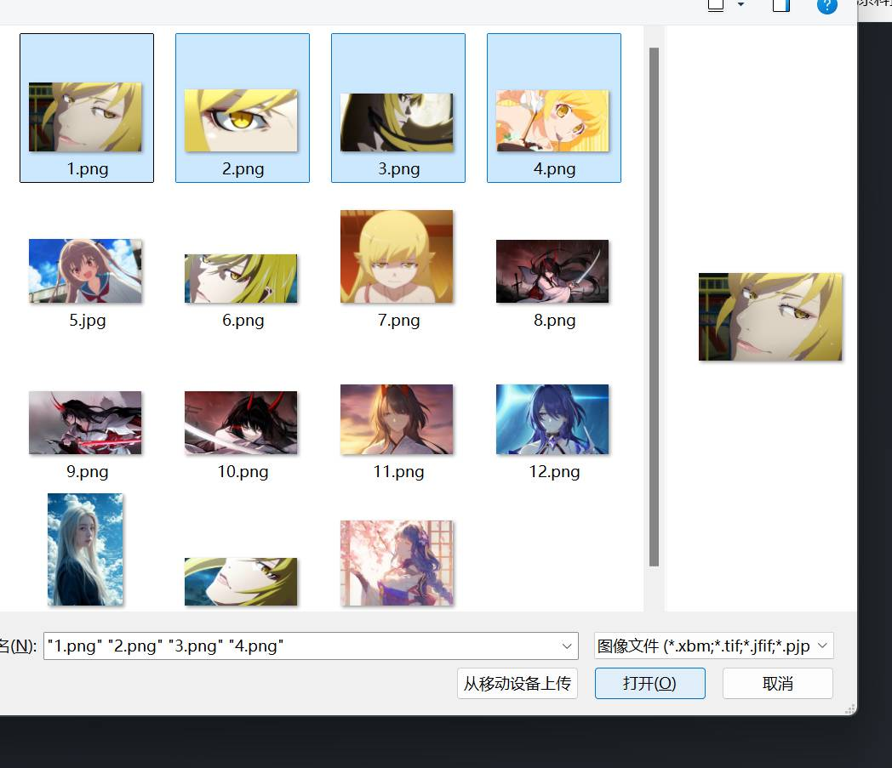

# img_compressed
一个轻量级的图片压缩工具

由于写博客时经常需要压缩图片，用 PS 太笨重，所以写了这个小工具，方便自己使用。

## 主要功能
- 用于压缩图片
- 调整图片分辨率
- 支持多文件上传

## 使用方式
```bash
pip install flask pillow werkzeug
```
启动后访问 http://127.0.0.1:5000/


选择上传文件后点击压缩即可使用，默认保存在 compressed 文件夹下，也可以在右侧设置中修改保存路径。

默认不调整分辨率，如需调整可以在右侧设置中修改压缩比例。

如果要调整到特定分辨率，需要将压缩比例设置为空，然后在分辨率中输入宽高，否则会按照压缩比例进行压缩。


支持多文件上传，压缩后会打包成 zip 文件下载。

多文件上传方式：

点击“选择图片文件”后，用鼠标多选文件，然后点击“打开”即可。



